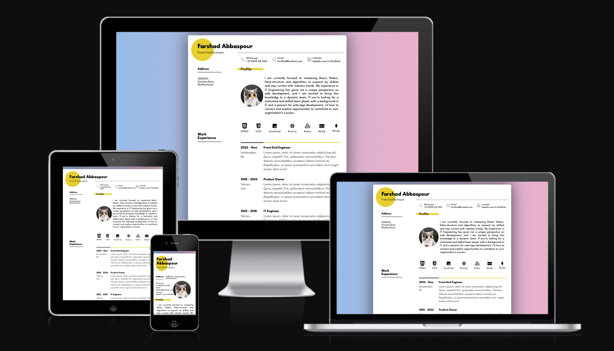

# CV Template coded by Far5had

This is a CV template includes sections for profile information, work experience, educational background, and links.
[Live View](https://fa125had.github.io/cv-template/)

## Prerequisites

To use this template, you will need the following:

- Basic knowledge of HTML and CSS/SCSS
- A code editor

## Technologies Used

The following technologies were used to develop this CV template:

- HTML
- CSS / SCSS
- Flexbox
- Responsive design
- Font Awesome - for icons
- Google Fonts - League Spartan font

## Design Inspiration

The design for this CV template was inspired by the "Minimalistic Resume" design on Dribbble. You can find the design inspiration at the following link: [Minimalistic Resume](https://dribbble.com/shots/20797890-Minimalistic-Resume). Please note that the original design was intended for A4 paper size, but the template has been made responsive for web viewing.

## Getting Started

1. Clone the repository or download the HTML and CSS files.
2. Open the HTML file in your preferred web browser.

## Usage

Feel free to modify the HTML/SCSS content according to your own information and preferences. Update the profile details, work experience, educational background, and links to match your own CV.

## License

This project is licensed under the [MIT License](LICENSE).

## Author

- Farshad Abbaspour - [GitHub](https://github.com/fa125had)

## Screenshot
